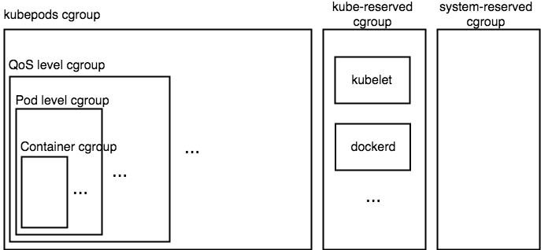
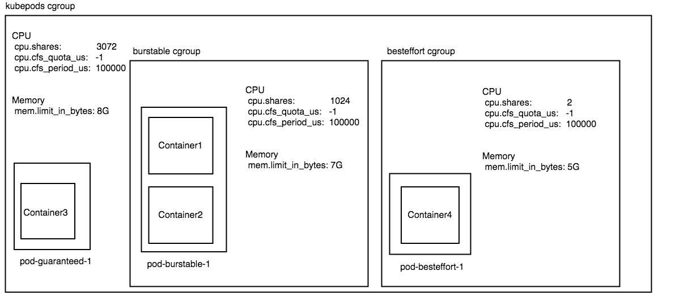
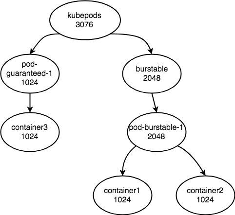

# Kubernetes 资源管理

资源，无论是计算资源，存储资源，网络资源，对于容器管理调度平台来说都是需要关注的一个核心问题。

- 如何对资源进行抽象，定义？
- 如何确认实际可以使用的资源量？
- 如何为容器分配它所申请的资源？

这些问题都是平台开发者需要仔细思考的。当然， kubernetes 在这个方面也提出了很多精巧，实用的设计方案。所以这篇博文所关注的就是有关 kubernetes 资源管理的相关问题。

这篇博文会依次讨论以下几个问题，希望能够通过尽量平实的语言为读者解析 kubernetes 在资源管理上的大致思路。

- 首先我们关注的是 kubernetes 对各种资源的抽象模型，也就是回答第一个问题：kubernetes 是如何对资源进行抽象和定义的呢？
- 然后我们将关注，kubernetes 是如何获取它可以使用的资源量的信息的。
- 在弄清楚 kubernetes 是如何定义资源，以及如何确认可用资源量后，我们将关注 kubernetes 是如何实际为 pod 分配资源的。

# 1. kubernetes 资源模型

### kubernetes 是怎么定义资源的呢？

在 kubernetes 中，任何可以被申请，分配，最终被使用的对象，都是 kubernetes 中的资源。比如 CPU，内存。

而且针对每一种被 kubernetes 所管理的资源，都会被赋予一个【资源类型名】，这些名字都是符合 RFC 1123 规则的。比如 CPU，它对应的资源名全称为，kubernetes.io/cpu（在展示时一般直接简写为 cpu）；GPU 资源对应的资源名为 alpha.kubernetes.io/nvidia-gpu。

除了名字以外，针对每一种资源还会对应有一种且仅有一种【基本单位】。这个基本单位一般是在 kubernetes 组件内部统一用来表示这种资源的数量的。比如 memory 的基本单位就是字节。

但是，为了方便开发者使用，在开发者通过 yaml 文件或者 kubectl 同 kubernetes 进行交互时仍可以使用多种可读性更好的资源单位，比如内存的 Gi，但是当这些信息进入 kubernetes 内部后，还是会被显式的转换为最基本单位。

所有的资源类型，又可以被划分为两大类，可压缩(compressible)和不可压缩(incompressible)的。其评判标准就在于：

- 如果系统限制或者缩小容器对可压缩资源的使用的话，只会影响服务对外的服务性能。比如 CPU 就是一种非常典型的可压缩资源。
- 对于不可压缩资源来说，资源的紧缺是有可能导致服务对外不可用的。比如内存就是一种非常典型的不可压缩资源。
	
### kubernetes 中有哪几类资源呢？

目前 kubernetes 默认带有两类基本资源

- CPU
- memory

其中 CPU，不管底层的机器是通过何种方式提供的（物理机 or 虚拟机），一个单位的 CPU 资源都会被标准化为一个标准的 "Kubernetes Compute Unit" ，大致和 x86 处理器的一个单个超线程核心是相同的。

CPU 资源的基本单位是 milicores，因为 CPU 资源其实准确来讲，指的是 CPU 时间。所以它的基本单位为 milicores，1 个核等于 1000 milicores。也代表了 kubernetes 可以将单位 CPU 时间细分为 1000 份，分配给某个容器。

memory 资源的基本单位比较好理解，就是字节。

另外，kubernetes 针对用户的自定制需求，还为用户提供了 device plugin 机制，让用户可以将资源类型进一步扩充，比如现在比较常用的 nvidia gpu 资源。这个特性可以使用户能够在 kubernetes 中管理自己业务中特有的资源，并且无需修改 kubernetes 自身源码。

而且 kubernetes 自身后续还会进一步支持更多非常通用的资源类型，比如网络带宽，存储空间，存储 iops 等等。

所以如上，我们就回答了，kubernetes 是如何定义资源的问题。

# 2. kubernetes 计算节点资源管理

了解了 kubernetes 是如何对资源进行定义的，我们再来看

### kubernetes 如何确定可以使用的资源量的呢？

kubernetes 所管理的集群中的每一台计算节点都包含一定的资源，kubernetes 如何获知这台计算节点有多少资源的呢？这些资源中又有多少可以被用户容器所使用呢？

我们在使用 kubernetes 时，会发现，每一个 Node 对象的信息中，有关资源的描述部分如下述所示 （通过 kubectl get node xxx -o yaml 命令可以得到）

```
  allocatable:
    cpu: "40"
    memory: 263927444Ki
    pods: "110"
  capacity:
    cpu: "40"
    memory: 264029844Ki
    pods: "110"
```

其中 【capacity】 就是这台 Node 的【资源真实量】，比如这台机器是 8核 32G 内存，那么在 capacity 这一栏中就会显示 CPU 资源有 8 核，内存资源有 32G（内存可能是通过 Ki 单位展示的）。

而 【allocatable】 指的则是这台机器【可以被容器所使用的资源量】。在任何情况下，allocatable 是一定小于等于 capacity 的。

比如刚刚提到的 8 核机器的，它的 CPU capacity 是 8 核，但是它的 cpu allocatable 量可以被调整为 6 核，也就是说调度到这台机器上面的容器一共最多可以使用 6 核 CPU，另外 2 核 CPU 可以被机器用来给其他非容器进程使用。

那么问题来了，

#### capacity 和 allocatable 信息都是如何确定的呢？

首先看 【capacity】 ，由于 capacity 反映的是这台机器的资源真实数量，所以确认这个信息的任务理所应当应该交给运行在每台机器上面的 kubelet 上面。

kubelet 目前把 cadvisor 的大量代码直接作为 vendor 引入。其实就相当于在 kubelet 内部启动了一个小的 cadvisor。在 kubelet 启动后，这个内部的 cadvisor 子模块也会相应启动，并且获取这台机器上面的各种信息。其中就包括了有关这台机器的资源信息，而这个信息也自然作为这台机器的真实资源信息，通过 kubelet 再上报给 apiserver。

**那么 allocatable 信息又是如何确认的呢？**

如果要介绍 allocatable 信息如何确认，首先必须介绍 Node Allocatable Resource 特性[6]。

Node Allocatable Resource 特性是由 kubernetes 1.6 版本引进的一个特性。主要解决的问题就是，为每台计算节点的【非容器进程】预留资源。

在 kubernetes 集群中的每一个节点上，除了用户容器还会运行很多其他的重要组件，他们并不是以容器的方式来运行的，这些组件的类型主要分为两个大类：

- kubernetes daemon：kubernetes 相关的 daemon 程序，比如 kubelet，dockerd 等等
- system daemon：和 kubernetes 不相关的其他系统级 daemon 程序，比如 sshd 等等。

这两种进程对于整个物理机的稳定的重要性是毋庸置疑的。所以针对这两种进程，kubernetes 分别提供了 Kube-Reserved 和 System-Reserved 特性，可以分别为这两组进程设定一个预留的计算资源量，比如预留 2 核 4G 的计算资源给系统进程用。

**那么 kubernetes 是如何实现这一点的呢？**

我们应该都有了解，kubernetes 底层是通过 cgroup 特性来实现资源的隔离与限制的，而这种资源的预留也是通过 cgroup 技术来实现的。

在默认情况下，针对每一种基本资源（CPU，memory），kubernetes 首先会创建一个根 cgroup 组，作为所有容器 cgroup 的根，名字叫做 kubepods。这个 cgroup 就是用来限制这台计算节点上所有 pod 所使用的资源的。默认情况下这个 kubepods cgroup 组所获取的资源就等同于该计算节点的全部资源。

但是，当开启 Kube-Reserved 和 System-Reserved 特性时，kubernetes 则会为 kubepods cgroup 再创建两个同级的兄弟 cgroup 分别叫做 kube-reserved 和 system-reserved，分别用来为 kubernetes daemon，system daemon 预留一定的资源并且与 kubepods cgroup 共同分配这个机器的资源。所以 kubepods 能够被分配到的资源势必就会小于机器的资源真实量了，这样从而就达到了为 kubernetes daemon，system daemon 预留资源的效果。

所以如果开启了 Kube-Reserved 和 System-Reserved 的特性的话，在计算 Node Allocatable 资源数量时必须把这两个 cgroup 占用的资源先减掉。

所以，假设当前机器 CPU 资源的 Capacity 是 32 核，然后我们分别设置 Kube-Reserved 为 2 核，System-Reserved 为 1 核，那么这台机机器真正能够被容器所使用的 CPU 资源只有 29 核。

但是在计算 memory 资源的 allocatable 数量时，除了 Kube-Reserved，System-Reserved 之外，还要考虑另外一个因素。那就是 Eviction Threshold。

**什么是 Eviction Threshold 呢？**

Eviction Threshold 对应的是 kubernetes 的 eviction policy 特性。该特性也是 kubernetes 引入的用于保护物理节点稳定性的重要特性。当机器上面的【内存】以及【磁盘资源】这两种不可压缩资源严重不足时，很有可能导致物理机自身进入一种不稳定的状态，这个很显然是无法接受的。

所以 kubernetes 官方引入了 eviction policy 特性，该特性允许用户为每台机器针对【内存】，【磁盘】这两种不可压缩资源分别指定一个 eviction hard threshold, 即资源量的阈值。

比如我们可以设定内存的 eviction hard threshold 为 100M，那么当这台机器的内存可用资源不足 100M 时，kubelet 就会根据这台机器上面所有 pod 的 QoS 级别（Qos 级别下面会介绍），以及他们的内存使用情况，进行一个综合排名，把排名最靠前的 pod 进行迁移，从而释放出足够的内存资源。

所以针对内存资源，它的 allocatable 应该是 [capacity] - [kube-reserved] - [system-reserved] - [hard-eviction]

所以，如果仔细观察你会发现，如果你的集群中没有开启 kube-reserved，system-reserved 特性的话，通过 kubectl get node \<node_name\> -o yaml 会发现这台机器的 CPU Capacity 是等于 CPU Allocatable 的，但是 Memory Capacity 却始终大于 Memory Allocatable，主要是因为 eviction 机制，在默认情况下，会设定一个 100M 的 memory eviction hard threshold，默认情况下，memory capacity 和 memory allocatable 之间相差的就是这 100M。	

# 3. kubernetes pod 资源管理与分配

通过上面我们了解了 kubernetes 如何定义并且确认在当前集群中有多少可以被利用起来的资源后，下面就来看一下 kubernetes 到底如何将这些资源分配给每一个 pod 的。

在介绍如何把资源分配给每一个 pod 之前，我们首先要看一下 pod 是如何申请资源的。这个对于大多数已经使用过 kubernetes 的童鞋来讲，并不是很陌生。

### 3.1 kubernetes pod 资源申请方式

kubernetes 中 pod 对资源的申请是以容器为最小单位进行的，针对每个容器，它都可以通过如下两个信息指定它所希望的资源量

- request
- limit 

比如 

```
resources: 
  requests:
    cpu: 2.5
    memory: "40Mi"
  limits: 
    cpu: 4.0
    memory: "99Mi"
```

那么 request，limit 分别又代表了什么含义呢？

- request：

request 指的是针对这种资源，这个容器希望能够保证能够获取到的最少的量。

但是在实际情况下，CPU request 是可以通过 cpu.shares 特性能够实现的。

但是内存资源，由于它是不可压缩的，所以在某种场景中，是有可能因为其他 memory limit 设置比 request 高的容器对内存先进行了大量使用导致其他 pod 连 request 的内存量都有可能无法得到满足。

- limit：

limit 对于 CPU，还有内存，指的都是是容器对这个资源使用的上限。

但是这两种资源在针对容器使用量超过 limit 所表现出的行为也是不同的。

对 CPU 来说，容器使用 CPU 过多，内核调度器就会切换，使其使用的量不会超过 limit。

对内存来说，容器使用内存超过 limit，这个容器就会被 OOM kill 掉，从而发生容器的重启。

在容器没有指定 request 的时候，request 的值和 limit 默认相等。

而如果容器没有指定 limit 的时候，request 和 limit 会被设置成的值则根据不同的资源有不同的策略。

### 3.2 kubernetes pod QoS 分类

kubernetes 支持用户容器通过 request，limit 两个字段指定自己的申请资源信息。那么根据容器指定资源的不同情况，Pod 也被划分为 3 种不同的 QoS 级别。分别为

- Guaranteed
- Burstable
- BestEffort

不同的 QoS 级别会在很多方面发挥作用，比如调度，eviction。

Guaranteed 级别的 pod 主要需要满足两点要求：

- pod 中的每一个 container 都必须包含内存资源的 limit，request 信息，并且这两个值必须相等
- pod 中的每一个 container 都必须包含 CPU 资源的 limit，request 信息，并且这两个信息的值必须相等

Burstable 级别的 pod 则需要满足两点要求，

- 资源申请信息不满足 Guaranteed 级别的要求
- pod 中至少有一个 container 指定了 cpu 或者 memory 的 request 信息

BestEffort 级别的 pod 需要满足

- pod 中任何一个 container 都不能指定 cpu 或者 memory 的 request，limit 信息

所以通过上面的描述也可以看出来，

- Guaranteed level 的 Pod 是优先级最高的，系统管理员一般对这类 Pod 的资源占用量比较明确。
- Burstable level 的 Pod 优先级其次，管理员一般知道这个 Pod 的资源需求的最小量，但是当机器资源充足的时候，还是希望他们能够使用更多的资源，所以一般 limit > request。
- BestEffort level 的 Pod 优先级最低，一般不需要对这个 Pod 指定资源量，所以无论当前资源使用如何，这个 Pod 一定会被调度上去，并且它使用资源的逻辑也是见缝插针，当机器资源充足的时候，它可以充分使用，但是当机器资源被 Guaranteed，Burstable 的 Pod 所抢占的时候，它的资源也会被剥夺，被无限压缩。


### 3.3 kubernetes pod 资源分配原理

我们在上面两个小节介绍了

- pod 申请资源的方式
- pod 申请资源的方式对应的是什么 QoS 级别

最终，kubelet 就是基于 【pod 申请的资源】 + 【pod 的 QoS 级别】来最终为这个 pod 分配资源的。

而分配资源的根本方法就是基于 cgroup 的机制。

kubernetes 在拿到一个 pod 的资源申请信息后，针对每一种资源，他都会做如下几件事情

- 对 pod 中的每一个容器，都创建一个 container level cgroup（注：这一步真实情况是 kubernetes 向 docker daemon 发送命令完成的）。
- 然后为这个 pod 创建一个 pod level cgroup ，它会成为这个 pod 下面包含的所有 container level cgroup 的父 cgroup。
- 最终，这个 pod level cgroup 最终会根据这个 pod 的 QoS 级别，可能被划分到某一个 QoS level cgroup 中，成为这个 QoS level cgroup 的子 cgroup。
- 整个 QoS level cgroup 还是所有容器的根 cgroup - kubepods 的子 cgroup。

所以这个嵌套关系通过下述图片可以比较清晰的展示出来。



图中代表了一个 kubernetess 计算节点的 cgroup 的层次结构（对于 cpu，memory 来说 cgroup 层次结构是完全一致的）。可见，所有 pod 的 cgroup 配置都位于 kubepods 这个大的 cgroup 下，而之前介绍的 kube-reserved cgroup 和 system-reserved cgroup 和 kubepods cgroup 位于一级，他们 3 个会共享机器的计算资源。

我们首先看如何确定这个 container 对应的 container level cgroup 和它所在的 pod level cgroup。

### 3.3.1 container level cgroup

首先，每一个 container 的 cgroup 的配置则是根据这个 container 对这种资源的 request，limit 信息来配置的。

我们分别看一下，针对 cpu，memory 两种资源，kubernetes 是如何为每一个容器创建 container 级别的 cgroup 的。

#### CPU 资源

首先是 CPU 资源，我们先看一下 CPU request。

CPU request 是通过 cgroup 中 CPU 子系统中的 cpu.shares 配置来实现的。

当你指定了某个容器的 CPU request 值为 x millicores 时，kubernetes 会为这个 container 所在的 cgroup 的 cpu.shares 的值指定为 x * 1024 / 1000。即

```
cpu.shares = (cpu in millicores * 1024) / 1000
```

举个栗子，当你的 container 的 CPU request 的值为 1 时，它相当于 1000 millicores，所以此时这个 container 所在的 cgroup 组的 cpu.shares 的值为 1024。

这样做希望达到的最终效果就是：

> 即便在极端情况下，即所有在这个物理机上面的 pod 都是 CPU 繁忙型的作业的时候（分配多少 CPU 就会使用多少 CPU），仍旧能够保证这个 container 的能够被分配到 1 个核的 CPU 计算量。
> 
> 其实就是保证这个 container 的对 CPU 资源的最低需求。

所以可见 cpu.request 一般代表的是这个 container 的最低 CPU 资源需求。但是其实仅仅通过指定 cpu.shares 还是无法完全达到上面的效果的，还需要对 QoS level 的 cgroup 进行同步的修改。至于具体实现原理我们在后面会详细介绍。

而针对 cpu limit，kubernetes 是通过 CPU cgroup 控制模块中的 cpu.cfs\_period\_us，cpu.cfs\_quota\_us 两个配置来实现的。kubernetes 会为这个 container cgroup 配置两条信息

```
cpu.cfs_period_us = 100000 (i.e. 100ms)
cpu.cfs_quota_us = quota = (cpu in millicores * 100000) / 1000
```

在 cgroup 的 CPU 子系统中，可以通过这两个配置，严格控制这个 cgroup 中的进程对 CPU 的使用量，保证使用的 CPU 资源不会超过 cfs\_quota\_us/cfs\_period\_us，也正好就是我们一开始申请的 limit 值。

可见通过 cgroup 的这个特性，就实现了限制某个容器的 CPU 最大使用量的效果。


#### memory

针对内存资源，其实 memory request 信息并不会在 container level cgroup 中有体现。kubernetes 最终只会根据 memory limit 的值来配置 cgroup 的。

在这里 kubernetes 使用的 memory cgroup 子系统中的 memory.limit\_in\_bytes 配置来实现的。配置方式如下

```
memory.limit_in_bytes = memory limit bytes
```

memory 子系统中的 limit\_in\_bytes 配置，可以限制一个 cgroup 中的所有进程可以申请使用的内存的最大量，如果超过这个值，那么根据 kubernetes 的默认配置，这个容器会被 OOM killed，容器实例就会发生重启。

可见如果是这种实现方式的话，其实 kubernetes 其实并不能保证 pod 能够真的申请到它指定的 memory.request 那么多的内存量，这也可能是让很多使用 kubernetes 的童鞋比较困惑的地方。因为 kubernetes 在对 pod 进行调度的时候，只是保证一台机器上面的 pod 的 memory.request 之和小于等于 node allocatable memory 的值。所以如果有一个 pod 的 memory.limit 设置的比较高，甚至没有设置，就可能会出现一种情况，就是这个 pod 使用了大量的内存（大于它的 request，但是小于它的 limit），此时鉴于内存资源是不可压缩的，其他的 pod 可能就没有足够的内存余量供其进行申请了。当然，这个问题也可以通过一个特性在一定程度进行缓解，这个会在下面介绍。

**当然读者可能会有一个问题，如果 pod 没有指定 request 或者 limit 会怎样配置呢？**

如果没有指定 limit 的话，那么 cfs\_quota\_us 将会被设置为 -1，即没有限制。而如果 limit 和 request 都没有指定的话，cpu.shares 将会被指定为 2，这个是 cpu.shares 允许指定的最小数值了。可见针对这种 pod，kubernetes 只会给他分配最少的 CPU 资源。

而对于内存来说，如果没有 limit 的指定的话，memory.limit\_in\_bytes 将会被指定为一个非常大的值，一般是 2^64 ，可见含义就是不对内存做出限制。

针对上面对 container level cgroup 的介绍，我们举个具体的栗子，假设一个 pod 名字叫做 pod-burstable-1 是由两个业务容器构成的 container1 container2，这两个 container 的资源配置分别如下

```
- image: image1
  name: container1
  resources:
    limits:
      cpu: 1
      memory: 1Gi
    requests:
      cpu: 1 
      memory: 1Gi 
- image: image2
  name: container2
  resources:
    limits:
      cpu: 2
      memory: 2Gi
    requests:
      cpu: 1 
      memory: 1Gi   
```

所以可见这个 pod 所有容器的 request，limit 都已经被指定，但是 request 和 limit 并不完全相等，所以这个 pod 的 QoS 级别为 Burstable。

另外还有一个 pod 名字叫做 pod-guaranteed-1，它由一个 container 构成，资源配置如下

```
- image: image3
  name: container3
  resources:
    limits:
      cpu: 1
      memory: 1Gi
    requests:
      cpu: 1
      memory: 1Gi
```

通过这个配置可见，它是一个 Guaranteed 级别的 Pod。

另外还有一个 pod 叫做 pod-besteffort-1 它有一个 container 构成，资源配置信息完全为空，那么这个 pod 就是 besteffort 级别的 pod。

所以通过上述描述的 cgroup 配置方式，这 3 个 pod 会创建 4 个 container cgroup 如下图所示


### pod level cgroup

创建完 container level 的 cgroup 之后，kubernetes 就会为同属于某个 pod 的 containers 创建一个 pod level cgroup。作为它们的父 cgroup。至于为何要引入 pod level cgroup，主要是基于几点原因

- 方便对 pod 内的容器资源进行统一的限制
- 方便对 pod 使用的资源进行统一统计

所以对于我们上面举的栗子，一个 pod 名称为 pod-burstable-1，它包含两个 container：container1，container2，那么这个 pod cgroup 的目录结构如下

```
pod-burstable-1
  |
  +- container1
  |
  +- container2
```

注：真实情况下 pod cgroup 的名称是 pod\<podID\>，这里为了表示清楚，用 pod name 代替

那么为了保证这个 pod 内部的 container 能够获取到期望数量的资源，pod level cgroup 也需要进行相应的 cgroup 配置。而配置的方式也基本满足一个原则

> pod level cgroup 的资源配置应该等于属于它的 container 的资源需求之和。

但是，这个规则在不同的 QoS 级别的 pod 下也有些细节上的区别。所以针对 Guaranteed 和 Burstable 级别的 Pod，每一个 Pod 的 cgroup 配置都可以由下述 3 个公式来完成。

```
cpu.shares = sum(pod.spec.containers.resources.requests[cpu])

cpu.cfs_quota_us = sum(pod.spec.containers.resources.limits[cpu]

memory.limit_in_bytes = sum(pod.spec.containers.resources.limits[memory])
```

从公式中可见，pod level cgroup 的 cpu.shares，cpu.cfs\_quota\_us，memory.limit\_in\_bytes 最终都等于属于这个 pod 的 container 的这 3 值的和。

当然在 Burstable，Besteffort 的场景下，有可能 container 并没有指定 cpu.limit，memory.limit，此时 cpu.cfs\_quota\_us，memory.limit\_in\_bytes 将不会采用这个公式，因为此时相当于不会对 pod 的 cpu，memory 的使用量做最大值的限制，所以此时这两个配置也会参照上一节中说道的“如果 container 如果没有设置 request 和 limit 的话”处理的方式一样。

所以针对我们在上面的举的例子 pod-burstable-1，就是一个非常典型的 burstable pod，根据 burstable pod 的资源配置公式，kubernetes 会为这个 pod 创建一个 pod 级别的 cgroup。另外 pod-guaranteed-1 也会创建一个 cgroup，这两个 pod level cgroup 的配置如下图所示


#### besteffort pod cgroup

上面我们讲到的 pod cgroup 配置规律是不能应用于 besteffort pod 的。

因为这个 QoS 级别的 pod 就像名字描述的那样，kubernetes 只能尽可能的保证你的资源使用，在资源被极端抢占的情况，这种 pod 的资源使用量应该被一定程度的限制，无论是 cpu，内存（当然这两种限制的机制完全不同）。

所以针对 besteffort 级别的 pod，由于这里面的所有容器都不包含 request，limit 信息，所以它的配置非常统一。

所以针对 cpu，整个 pod 的 cgroup 配置就只有下面

```
cpu.shares = 2
```

可见这个配置的目标就是能够达到，它在机器 cpu 资源充足能使用整个机器的 cpu，因为没有指定 limit，但是在 cpu 资源被极端抢占时，它能够被分配的 cpu 资源很有限，相当于 2 milicores。

针对内存，没有任何特殊配置，只是采用默认，虽然在这种情况下，这个 pod 可能会使用整个机器那么多的内存，但是 kubernetes eviction 机制会保证，内存不足时，优先删除 Besteffort 级别的 pod 腾出足够的内存资源。

### QoS level cgroup

前面也提过，在 kubelet 启动后，会在整个 cgroup 系统的根目录下面创建一个名字叫做 kubepods 子 cgroup，这个 cgroup 下面会存放所有这个节点上面的 pod 的 cgroup。从而达到了限制这台机器上所有 Pod 的资源的目的。

在 kubepods cgroup 下面，kubernetes 会进一步再分别创建两个 QoS level cgroup，名字分别叫做

- burstable
- besteffort

通过名字也可以推断出，这两个 QoS level 的 cgroup 肯定是作为各自 QoS 级别的所有 Pod 的父 cgroup 来存在的。

那么问题就来了

- guaranteed 级别的 pod 的 pod cgroup 放在哪里了呢？
- 这两个 QoS level cgroup 存在的目的是什么？

首先第一个问题，所有 guaranteed 级别的 pod 的 cgroup 其实直接位于 kubepods 这个 cgroup 之下，和 burstable，besteffort QoS level cgroup 同级。主要原因在于 guaranteed 级别的 pod 有明确的资源申请量（request）和资源限制量（limit），所以并不需要一个统一的 QoS level 的 cgroup 进行管理或限制。

针对 burstable 和 besteffort 这两种类型的 pod，在默认情况下，kubernetes 则是希望能尽可能地提升资源利用率，所以并不会对这两种 QoS 的 pod 的资源使用做限制。

但是在很多场景下，系统管理员还是希望能够尽可能保证 guaranteed level pod 这种高 QoS 级别的 pod 的资源，尤其是不可压缩资源（如内存），不要被低 QoS 级别的 pod 提前使用，导致高 QoS 级别的 pod 连它 request 的资源量的资源都无法得到满足。

所以，kubernetes 才引入了 QoS level cgroup，主要目的就是限制低 QoS 级别的 pod 对不可压缩资源（如内存）的使用量，为高 QoS 级别的 pod 做资源上的预留。三种 QoS 级别的优先级由高到低为 guaranteed > burstable > besteffort。

那么到底如何实现这种资源预留呢？主要是通过 kubelet 的 experimental-qos-reserved 参数来控制，这个参数能够控制以怎样的程度限制低 QoS 级别的 pod 的资源使用，从而对高级别的 QoS 的 pod 实现资源上的预留，保证高 QoS 级别的 pod 一定能够使用到它 request 的资源。

目前只支持对内存这种不可压缩资源的预留情况进行指定。比如 experimental-qos-reserved=memory=100%，代表我们要 100% 为高 QoS level 的 pod 预留资源。

所以针对这个场景，对于内存资源来说，整个 QoS Level cgroup 的配置规则如下

```
burstable/memory.limit_in_bytes = 
    Node.Allocatable - {(summation of memory requests of `Guaranteed` pods)*(reservePercent / 100)}
besteffort/memory.limit_in_bytes = 
    Node.Allocatable - {(summation of memory requests of all `Guaranteed` and `Burstable` pods)*(reservePercent / 100)}

```

从公式中可见，burstable 的 cgroup 需要为比他等级高的 guaranteed 级别的 pod 的内存资源做预留，所以默认情况下，如果没有指定这个参数，burstable cgroup 中的 pod 可以把整个机器的内存都占满，但是如果开启这个特性，burstable cgroup 的内存限制就需要动态的根据当前有多少 guaranteed 级别 pod 来进行动态调整了。

besteffort 也是类似，但是不一样的地方在于 besteffort 不仅要为 guaranteed 级别的 pod 进行资源预留，还要为 burstable 级别的 pod 也进行资源的预留。

所以举个栗子，当前机器的 allocatable 内存资源量为 8G，我们为这台机器的 kubelet 开启 experimental-qos-reserved 参数，并且设置为 memory=100%。如果此时创建了一个内存 request 为 1G 的 guaranteed level 的 pod，那么此时这台机器上面的 burstable QoS level cgroup 的 memory.limit\_in\_bytes 的值将会被设置为 7G，besteffort QoS level cgroup 的 memory.limit\_in\_bytes 的值也会被设置为 7G。

而如果此时又创建了一个 burstable level 的 pod，它的内存申请量为 2G，那么此时 besteffort QoS level cgroup 的 memory.limit\_in\_bytes 的值也会被调整为 5G。

内存虽然搞定了，但是对于 cpu 资源反而带来一些麻烦。

针对 besteffort 的 QoS，它的 cgroup 的 CPU 配置还是非常简单

```
besteffort/cpu.shares = 2
```

但是针对 burstable 的 QoS，由于所有的 burstable pod 现在都位于 kubepods 下面的 burstable 这个子组下面，根据 cpu.shares 的背后实现原理，位于不同层级下面的 cgroup，他们看待同样数量的 cpu.shares 配置可能最终获得不同的资源量。比如在 Guaranteed 级别的 pod cgroup 里面指定的 cpu.shares=1024，和 burstable 下面的某个 pod cgroup 指定 cpu.shares=1024 可能最终获取的 cpu 资源并不完全相同。这个是因为 cpu.shares 自身机制导致的。

所以为了能够解决这个问题，kubernetes 也必须动态调整 burstable cgroup 的 cpu.shares 的配置，如下文档中描述的那样

```
burstable/cpu.shares = max(sum(Burstable pods cpu requests, 2)
```

来保证，相同的 cpu.shares 配置，对于 guaranteed 级别的 pod 和 burstable 的 pod 来说是完全一样的。

至于为什么这样做我们将在后面进行详细的解释。

所以对于我们上面的例子，3 个 pod 分别为 guaranteed，burstable，besteffort 级别的，假设当前机器的 kubelet 开启了 experimental-qos-reserved 参数并且指定为 memory=100%。假设这 3 pod 运行在一台 3 核 8G 内存的机器上面，那么此时整个机器的 cgroup 配置将如下：




通过这一系列的配置后，我们达到的效果就是

- 在机器 cpu 资源空闲时，pod-guaranteed-1 这个 pod 最多可以使用 1 核 cpu 的计算力。pod-burstable-1 这个 pod 最多可以使用 3 核的 cpu 计算力，pod-besteffort-1 这个 pod 可以把机器剩余的计算力跑满。
- 当机器 cpu 资源被抢占的时候，比如 pod-guaranteed-1，pod-burstable-1 这两种资源都在 100% 的使用 cpu 的时候，pod-guaranteed-1 仍旧可以获取 1 核的 cpu 计算力，pod-burstable-1 仍旧可以获取 2 核的计算力。但是 pod-besteffort-1 仅仅能获取 2 milicores 的 cpu 计算力，是 pod-burstable-1 的千分之一。
- 该机器的 besteffort 级别的 pod，能够使用的最大内存量为[机器内存 8G] - [sum of request of burstable 2G] - [sum of request of guaranteed 1G] = 5G
- 该机器的 burstable 级别的 pod，能够使用的最大内存量为 [机器内存 8G] - [sum of request of guaranteed 1G] = 7G

### CPU Request 的实现

CPU 资源的 request 量代表这个容器期望获取的最小资源量。它是通过 cgroup cpu.shares 特性来实现的。但是这个 cpu.shares 真实代表的这个 cgroup 能够获取机器 CPU 资源的【比重】，并非【绝对值】。

比如某个 cgroup A 它的 cpu.shares = 1024 并不代表这个 cgroup A 能够获取 1 核的计算资源，如果这个 cgroup 所在机器一共有 2 核 CPU，除了这个 cgroup 还有另外 cgroup B 的 cpu.shares 的值为 2048 的话。那么在 CPU 资源被高度抢占的时候，cgroup A 只能够获取 2 * (1024/(1024 + 2048)) 即 2/3 的 CPU 核资源。

那么 kubernetes 又是如何实现，无论是什么 QoS 的 pod，只要它的某个容器的 cpu.shares = 1024，那么它就一定能够获取 1 核的计算资源的呢？

实现的方式其实就是通过合理的对 QoS level cgroup，Pod level cgroup 进行动态配置来实现的。

我们还可以用上面的栗子继续描述，假设目前这 3 个 Pod 就位于一个有 3 个 CPU 核的物理机上面。此时这台机器的 CPU cgroup 的配置会变成下面的样子

- kubepods cgroup 的 cpu.shares 将会被设置为 3072。
- pod-guaranteed-1 中的 pod cgroup 的 cpu.shares 将会被设置为 1024，pod cgroup 内的 container3 的 container cgroup 的 cpu.shares 将会被设置为 1024。
- pod-burstable-1 所在 burstable QoS level cgroup cpu.shares 将会被设置为 2048
- pod-burstable-1 的 pod cgroup 的 cpu.shares 是 2048
- pod-burstable-1 中的 container1 的 cpu.shares 是 1024
- pod-burstable-1 中的 container2 的 cpu.shares 是 1024

所以此时的层次结构如下图



因为 besteffort 的 cpu.shares 的值仅仅为 2，可以忽略。

所以此时在计算 container1，container2，container3 在 CPU 繁忙时的 CPU 资源时，就可以按照下述公式来进行计算

- container3 = (1024/1024) * (1024/(1024+2048)) * 3 = 1
- container1 = (1024/(1024+1024)) * (2048/2048) * (2048/1024+2048) * 3 = 1
- container2 = (1024/(1024+1024)) * (2048/2048) * (2048/1024+2048) * 3 = 1

可见，kubernetes 是通过巧妙的设置 kubepods cgroup 的 cpu.shares，以及合理的更新 burstable QoS level cgroup 的配置来实现 cpu.shares 就等于容器可以获取的最小 CPU 资源的效果的。
 


## 参考引用

1. Kubernetes Resource Model: https://github.com/kubernetes/community/blob/master/contributors/design-proposals/scheduling/resources.md

2. Kubernetes Container and pod resource limits Issue: https://github.com/kubernetes/kubernetes/issues/168
3. Core Metrics in kubelet: https://github.com/kubernetes/community/blob/master/contributors/design-proposals/instrumentation/core-metrics-pipeline.md
4. Kubernetes Monitor Architecture: https://github.com/kubernetes/community/blob/master/contributors/design-proposals/instrumentation/monitoring_architecture.md
5. Standalone of cadvisor: https://github.com/kubernetes/kubernetes/issues/18770
6. Kubernetes Node Allocatable Resource: https://github.com/kubernetes/community/blob/master/contributors/design-proposals/node/node-allocatable.md#phase-2---enforce-allocatable-on-pods
7. https://kubernetes.io/docs/tasks/configure-pod-container/quality-service-pod/
8. https://github.com/kubernetes/community/blob/master/contributors/design-proposals/node/pod-resource-management.md


–