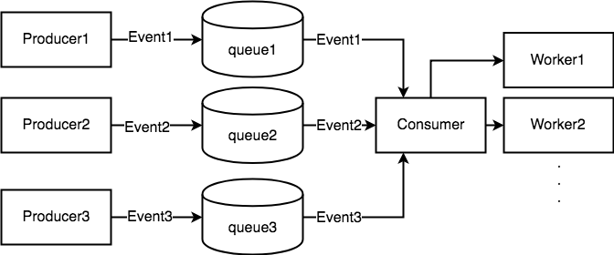

# kubelet 主框架解析

# 简介

kubelet 组件主要负责管理这台机器上面的 pod 的生命周期，以及这台机器的一些状态的更新与上报。这篇文章的目的就在于对 kubelet 整体的设计框架进行分析。并不会对任意一个子功能的细节进行深入的介绍。

# kubelet 结构图

kubelet 内部其实是由多个子模块来构成的，每个子模块都单独负责一部分的任务，而所有的子模块都由下面两个对象来管理，这两个对象也是 kubelet 中最重要的两个对象

- kubeletDeps：该对象中包含一系列 kubelet 依赖的外部功能，比如 cadvisor，containerManager(负责 cgroup 管理)。

- kubelet：kubelet 对象则代表 kubelet 自身，其中也包括很多子模块，用于完成不同的功能。

那么 kubelet 中各个子模块之间又是如何配合工作的呢？主要是基于生产者消费者的模型。

整个 kubelet 的工作就是在围绕着不同的生产者生产出来的不同的消息来调用相应的消费者完成不同的行为。如下图所示



## 消息生产者，消费者简述

那么 kubelet 中主要包含哪几个消息的生产者呢？消费者又是怎么消费的呢？

我们可以在 kubelet 的 syncLoopIteration 函数中看到 kubelet 到底同时接收哪几个信息源

```
// * configCh: dispatch the pods for the config change to the appropriate
//             handler callback for the event type
// * plegCh: update the runtime cache; sync pod
// * syncCh: sync all pods waiting for sync
// * houseKeepingCh: trigger cleanup of pods
// * liveness manager: sync pods that have failed or in which one or more
//                     containers have failed liveness checks
func (kl *Kubelet) syncLoopIteration(...) {
	case u, open := <-configCh:
		...
	case e := <-plegCh:
		...
	case <-syncCh:
		...
	case update := <-kl.livenessManager.Updates():
		...
	case <-housekeepingCh:
		...
}
```

通过代码注释可以看出，kubelet 主要有 5 个不同的信息源

- configCh: 该信息源由 kubeDeps 对象中的 podConfig 子模块提供，该模块将同时 watch 3 个不同来源的 pod 信息的变化（file，http，apiserver），一旦某个来源的 pod 信息发生了更新，这个 channel 中就会出现被更新的 pod 信息和更新操作。
- plegCh: 该信息源由 kubelet 对象中的 pleg 子模块提供，该模块主要用于周期性地向 container runtime 查询当前所有容器的状态，如果状态发生变化，则这个 channel 产生事件。[1]
- syncCh: 该信息源是一个周期性的信号源(默认1秒)，周期性同步所有需要再次同步的 pod。？？？
- liveness manager update: 该信息源是由 kubelet 对象中 livenessManager 管理，当某个容器的 liveness probe 状态发生了变化，则会产生事件。
- housekeepingCh: 该信息源也是一个周期性信号源(默认2秒)，周期性的清理一些无用 pod。

所有的这些消息源产生的消息都由 kubelet 对象统一接受，并且调用相应的功能函数来完成相应的操作。

kubelet 对象自身提供了一系列处理不同对象的 handler 函数，并且暴露成 SyncHandler 接口，其中包含针对不同信息源里不同消息类型的处理函数

```
type SyncHandler interface {
	HandlePodAdditions(pods []*v1.Pod)
	HandlePodUpdates(pods []*v1.Pod)
	HandlePodRemoves(pods []*v1.Pod)
	HandlePodReconcile(pods []*v1.Pod)
	HandlePodSyncs(pods []*v1.Pod)
	HandlePodCleanups() error
}
```

当然，每一个处理函数背后可能都需要 kubelet 对象去调用背后多个内部子模块来共同完成，比如 HandlePodAddition 函数，处理 Pod 的创建，其中可能需要

- 调用 kubelet.podManager 子模块 AddPod 函数，注册该 pod 信息
- 调用 kubelet.podWorker 子模块为这个 Pod 创建单独的 worker goroutine 完成具体的操作
- 调用 kubelet.containerManager 子模块为这个 Pod 创建相应的 Pod Level Cgroup 
- 调用 kubelet.volumeManager 子模块为这个 Pod 准备需要被 Mount 到容器中的文件系统
- 调用 kubelet.containerRuntime 子模块真正的创建 Pod 的实体
- ....

所以综上，整个 kubelet 的所有内部子模块就是通过这种生产者消费者模型协调工作，及时将 Pod 以用户期望的状态维护在它所在的机器上。

针对不同的消息来源的不同消息，我们将分别用单独的文章来介绍它实现的细节。

## kubelet 节点状态的守护进程

除了上一小节说到的生产者消费者框架，kubelet 中还包括一些子模块为了

- 维护物理机稳定性
- 同步更新物理机配置

等目的，周期性不间断工作的子模块，他们也是 kubelet 中非常重要的一部分。

针对这些子模块的工作模式，我们也将用单独的文章来具体介绍他们的实现细节。


## 参考引用

1. https://github.com/kubernetes/community/blob/master/contributors/design-proposals/node/pod-lifecycle-event-generator.md

## 附录1 kubelet 核心函数解析

kubelet 第一个关键函数 

cmd/kubelet/app/server.go run 函数

其中比较关键的步骤包括

1. 初始化 kubeDeps 中的一些外部注入对象
2. 初始化 kubeDeps 监控子对象 CAvisorInterface 
3. 初始化 kubeDeps 中的 ContainerManager 对象
4. 调用 RunKubelet 启动 kubelet

```
func run(s *options.KubeletServer, kubeDeps *kubelet.KubeletDeps) (err error) {
			...
			// 1. 
			kubeDeps, err = UnsecuredKubeletDeps(s)
			...
			// 2.
			kubeDeps.CAdvisorInterface, err = cadvisor.New(uint(s.CAdvisorPort), s.ContainerRuntime, s.RootDirectory)
			...
			// 3. 
			kubeDeps.ContainerManager, err = cm.NewContainerManager(
			...
			
			// 4. 
			if err := RunKubelet(&s.KubeletFlags, &s.KubeletConfiguration, kubeDeps, s.RunOnce, standaloneMode); err != nil {
			...
}
```

可见 run 函数中主要是对 kubeDeps 对象中的一些重要对象进行初始化操作，在初始化完成之后，调用 RunKubelet 函数，继续启动 kubelet

RunKubelet 函数则主要是用于继续初始化 kubelet 对象，并且最终启动 kubelet 对象

其中 初始化 kubelet 对象 是 CreateAndInitKubelet 函数

启动 kubelet 是 startKubelet 函数

cmd/kubelet/app/server.go

```
func RunKubelet(kubeFlags *options.KubeletFlags, kubeCfg *componentconfig.KubeletConfiguration, kubeDeps *kubelet.KubeletDeps, runOnce bool, standaloneMode bool) error {

	...
	// 初始化 kubelet
		k, err := builder(kubeCfg, kubeDeps, &kubeFlags.ContainerRuntimeOptions, standaloneMode, kubeFlags.HostnameOverride, kubeFlags.NodeIP, kubeFlags.ProviderID)

	// 启动 kubelet
	startKubelet(k, podCfg, kubeCfg, kubeDeps)

}

```

RunKubelet 中对 kubelet 的初始化操作主要是 NewMainKubelet 函数，该函数可以创建一个 Kubelet 类型的对象，这也是 kubelet 代码中最为重要的对象

```
func CreateAndInitKubelet(kubeCfg *componentconfig.KubeletConfiguration, kubeDeps *kubelet.KubeletDeps, crOptions *options.ContainerRuntimeOptions, standaloneMode bool, hostnameOverride, nodeIP, providerID string) (k kubelet.KubeletBootstrap, err error) {
	// TODO: block until all sources have delivered at least one update to the channel, or break the sync loop
	// up into "per source" synchronizations

	k, err = kubelet.NewMainKubelet(kubeCfg, kubeDeps, crOptions, standaloneMode, hostnameOverride, nodeIP, providerID)
	if err != nil {
		return nil, err
	}

	k.BirthCry()

	k.StartGarbageCollection()

	return k, nil
}
```

在 CreateAndInitKubelet 初始化好 kubelet 对象之后，继续调用 startKubelet 函数真正启动这个 kubelet 对象的工作流程。

```
func startKubelet(k kubelet.KubeletBootstrap, podCfg *config.PodConfig, kubeCfg *componentconfig.KubeletConfiguration, kubeDeps *kubelet.KubeletDeps) {
	// start the kubelet
	go wait.Until(func() { k.Run(podCfg.Updates()) }, 0, wait.NeverStop)

	...
}
```

其中会调用刚刚创建的 Kubelet 对象的 Run 函数

在该函数中就包含了 kubelet 的主工作进程

```
// Run starts the kubelet reacting to config updates
func (kl *Kubelet) Run(updates <-chan kubetypes.PodUpdate) {
	...
	
	// Kubelet 主工作进程
	kl.syncLoop(updates, kl)
}

```

kubelet 的主工作进程采取的也是生产者消费者的编程模型，其中生产者包括多个来源，

- kubeDeps.PodConfig 对象提供的 PodUpdate Channel
- 周期性检查哪些 pod 的状态需要同步
- 周期性检查哪些 pod 源的状态还活着
- PLEG 引发的事件

不同的事件源到来的事件，以及生成事件的原理，我们需要分别用单独的文章介绍。

而 kubelet 自身作为消费者也实现了针对不同类型的事件的处理行为

- HandlePodAdditions
- HandlePodUpdates
- HandlePodRemoves
- HandlePodReconcile
- HandlePodSyncs
- HandlePodCleanups

当然这些行为都是通过 kubelet 内其他内部模块配合完成的

如下即是 kubelet 同步 pod 状态的主函数

```
func (kl *Kubelet) syncLoopIteration(configCh <-chan kubetypes.PodUpdate, handler SyncHandler,
	syncCh <-chan time.Time, housekeepingCh <-chan time.Time, plegCh <-chan *pleg.PodLifecycleEvent) bool {
	select {
	case u, open := <-configCh:
		// Update from a config source; dispatch it to the right handler
		// callback.
		if !open {
			glog.Errorf("Update channel is closed. Exiting the sync loop.")
			return false
		}

		switch u.Op {
		case kubetypes.ADD:
			glog.V(2).Infof("SyncLoop (ADD, %q): %q", u.Source, format.Pods(u.Pods))
			// After restarting, kubelet will get all existing pods through
			// ADD as if they are new pods. These pods will then go through the
			// admission process and *may* be rejected. This can be resolved
			// once we have checkpointing.
			handler.HandlePodAdditions(u.Pods)
		case kubetypes.UPDATE:
			glog.V(2).Infof("SyncLoop (UPDATE, %q): %q", u.Source, format.PodsWithDeletiontimestamps(u.Pods))
			handler.HandlePodUpdates(u.Pods)
		case kubetypes.REMOVE:
			glog.V(2).Infof("SyncLoop (REMOVE, %q): %q", u.Source, format.Pods(u.Pods))
			handler.HandlePodRemoves(u.Pods)
		case kubetypes.RECONCILE:
			glog.V(4).Infof("SyncLoop (RECONCILE, %q): %q", u.Source, format.Pods(u.Pods))
			handler.HandlePodReconcile(u.Pods)
		case kubetypes.DELETE:
			glog.V(2).Infof("SyncLoop (DELETE, %q): %q", u.Source, format.Pods(u.Pods))
			// DELETE is treated as a UPDATE because of graceful deletion.
			handler.HandlePodUpdates(u.Pods)
		case kubetypes.SET:
			// TODO: Do we want to support this?
			glog.Errorf("Kubelet does not support snapshot update")
		}

		// Mark the source ready after receiving at least one update from the
		// source. Once all the sources are marked ready, various cleanup
		// routines will start reclaiming resources. It is important that this
		// takes place only after kubelet calls the update handler to process
		// the update to ensure the internal pod cache is up-to-date.
		kl.sourcesReady.AddSource(u.Source)
	case e := <-plegCh:
		if isSyncPodWorthy(e) {
			// PLEG event for a pod; sync it.
			if pod, ok := kl.podManager.GetPodByUID(e.ID); ok {
				glog.V(2).Infof("SyncLoop (PLEG): %q, event: %#v", format.Pod(pod), e)
				handler.HandlePodSyncs([]*v1.Pod{pod})
			} else {
				// If the pod no longer exists, ignore the event.
				glog.V(4).Infof("SyncLoop (PLEG): ignore irrelevant event: %#v", e)
			}
		}

		if e.Type == pleg.ContainerDied {
			if containerID, ok := e.Data.(string); ok {
				kl.cleanUpContainersInPod(e.ID, containerID)
			}
		}
	case <-syncCh:
		// Sync pods waiting for sync
		podsToSync := kl.getPodsToSync()
		if len(podsToSync) == 0 {
			break
		}
		glog.V(4).Infof("SyncLoop (SYNC): %d pods; %s", len(podsToSync), format.Pods(podsToSync))
		kl.HandlePodSyncs(podsToSync)
	case update := <-kl.livenessManager.Updates():
		if update.Result == proberesults.Failure {
			// The liveness manager detected a failure; sync the pod.

			// We should not use the pod from livenessManager, because it is never updated after
			// initialization.
			pod, ok := kl.podManager.GetPodByUID(update.PodUID)
			if !ok {
				// If the pod no longer exists, ignore the update.
				glog.V(4).Infof("SyncLoop (container unhealthy): ignore irrelevant update: %#v", update)
				break
			}
			glog.V(1).Infof("SyncLoop (container unhealthy): %q", format.Pod(pod))
			handler.HandlePodSyncs([]*v1.Pod{pod})
		}
	case <-housekeepingCh:
		if !kl.sourcesReady.AllReady() {
			// If the sources aren't ready or volume manager has not yet synced the states,
			// skip housekeeping, as we may accidentally delete pods from unready sources.
			glog.V(4).Infof("SyncLoop (housekeeping, skipped): sources aren't ready yet.")
		} else {
			glog.V(4).Infof("SyncLoop (housekeeping)")
			if err := handler.HandlePodCleanups(); err != nil {
				glog.Errorf("Failed cleaning pods: %v", err)
			}
		}
	}
	return true
}
```


